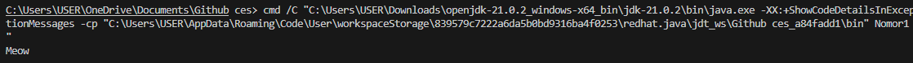
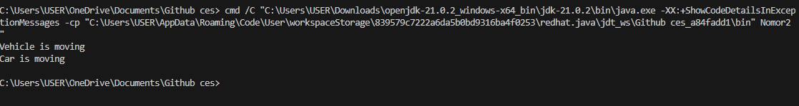
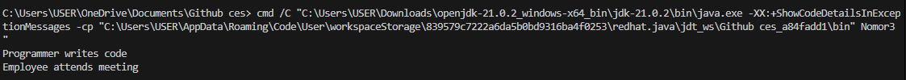

Nomor 1
 Ouput :
 
 Penjelasan : Karena methode sound di class animal di override dengan methode sound di class cat, yaitu extendnya class animal. Dan pada bagian main ada "Animal a = new Cat();" itu membuat animal sebagai variabel dan cat sebagai obeject dari a. Dan yang di run adalah a.sound
 
 
Nomor 2
 Ouput :
 
 Penjelasan : Karena pada main yang di run adalah objek v1 dan v2, dan v1 itu memiliki objek baru dari class  Vehicle dan v2 dari  Car. Dan kedua di jalankan menggunakan method move, v1 dengan print "Vehicle is moving" dan v2 override(menimpa) methode move dari v1 "Car is moving"
 
 
Nomor 3
 Ouput :

 Penjelasan : 
 Metode override = menimpa, contoh nya class programmer yang sudah mewarisi metode work dari class employee yang memiliki output "employee is working" di timpa dengan output "programmer writes code" dari class Programmer.
 Metode inheritance = mewarisi, contoh nya adalah class programmer yang mewarisi metode work dari employee
